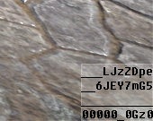
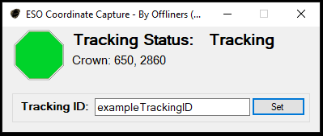
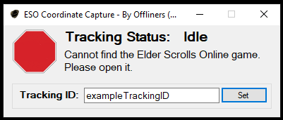
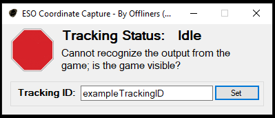

Offliners Cyrodiil Tracker Setup
===
`Please report any issues to @mikebald in ESO or mikebald#5934 on discord`

To utilize OPS [Offliners Positioning System] found at https://offlinerseso.com/ops you'll need multiple pieces to make that work. Below are a list of items you'll need:
 

# Download Required Components

  * ESO Coordinate Capture :: https://github.com/mikebald/ESOCoordinateCapture/releases/tag/Releases
  * CyrodiilTracker Addon :: https://github.com/mikebald/ESO_CyrodiilTracker/releases/tag/Release

# Optional Components
  
  This may be needed if you experience issues running ESO Coordinate Capture

  * Microsoft .Net Framework 4.8 Offline Installer : https://go.microsoft.com/fwlink/?linkid=2088631

# Install Steps

  * Extract and install the CyrodiilTracker addon. If you're unfamiliar with installing addons manually, see : https://www.esoui.com/forums/faq.php?faq=install
  * Extract ESO Coordinate Capture wherever you please; Desktop is perfectly fine.

# What now?

  * OPS works by capturing the location data from the addon [located in the lower right of your screen in game] and providing that data to the OPS website. If you provide the tracking ID, or direct link, anyone can view the Group's Crown's movements on the website.
  * Run ESO coordinate capture and be sure to change the Tracking ID. You can double click on the text field next to "Tracking ID:" to get one randomly generated, or you can use your own! Only AlphaNumeric characters are accepted, so cool it with "E_S_O †r@Ck3R¡". I've tried to make the ESO Coordinate Capture as idiot-proof as possible, but if you prove me wrong, let me know =D.
  * Once you click the "Set" button, you have the OPS url copied to your clipboard, so you can paste that into Discord or ESO for your friends. Below are some Troubleshooting steps for different errors you may see.

# Troubleshooting

  * The Ingame Addon should show up like this:  
      
   If the bottom line shows 0000000000, you can use the command `/ct reload` to reload the Crown Tracking.

  * This is what it looks like when tracking is normal:   
  
  * This means the Tracker cannot detect that ESO is currently running.   
    
  If it's running, oopsie... contact @mikebald: 
  * This means the Tracker cannot see the output from the addon:  
    
  It's possible your taskbar is hiding the addon, another addon is on top of CyrodiilTracker, or some other reason.